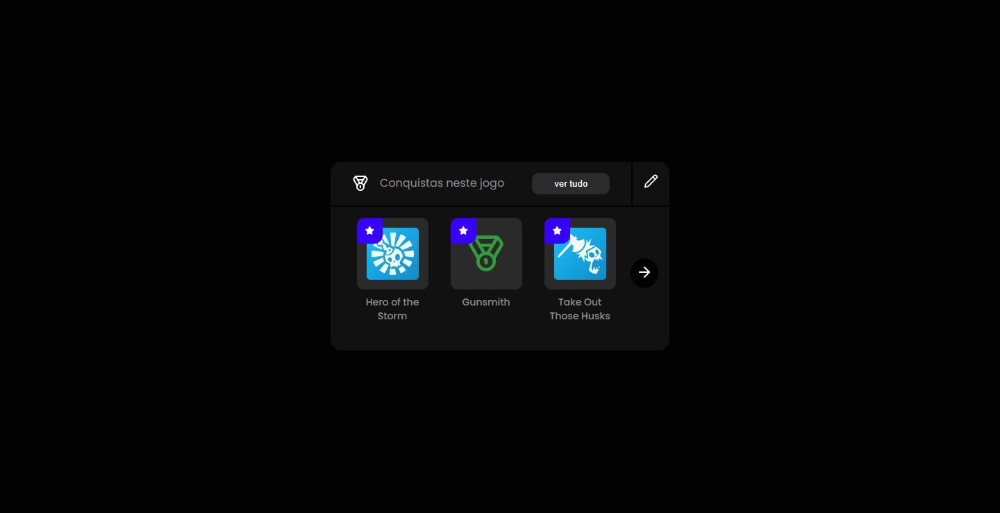

# 4U -  Front-end Test

Essa é a solução para o teste proposto pela 4UPlayer. O objetivo era reproduzir o layout disponibilizado pelo link:

[Figma](https://www.figma.com/design/BCCx6g525UFtcI7B7AjdIl/4U---Front-end-Test?node-id=1-9099&t=a6iUNMHz0ibx0CNT-0)

### Screenshot

### Links

- Solution URL: [Repository](https://github.com/aslinsjr/browser-extensions-manager-ui)
- Live Site URL: [Page](https://aslinsjr.github.io/browser-extensions-manager-ui/)

### Construido com

- HTML semântico
- CSS puro
- React.js

## Author

- Linkedln - [Alexandre Lins](https://www.linkedin.com/in/aslinsjr/)

